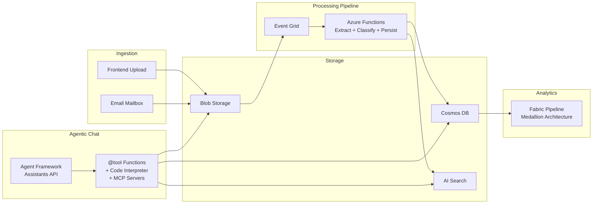

# Spend Analyzer -- Invoice/Receipt Processing Pipeline

End-to-end invoice and receipt processing pipeline with an agentic chat interface. Invoices are ingested via frontend upload or shared mailbox email, extracted with Azure Document Intelligence, classified with Azure OpenAI, persisted to Cosmos DB and AI Search, and made queryable through a fully agentic chat assistant powered by Microsoft Agent Framework.

## Architecture

See [docs/architecture/system-overview.md](docs/architecture/system-overview.md) for the full system diagram.



## Core Data Flows

1. **Frontend Upload**: User drags files onto the upload page -> API saves to blob -> Event Grid fires -> Azure Function extracts, classifies, and persists
2. **Email Ingestion**: Logic App monitors shared mailbox -> saves attachments to blob -> same Event Grid -> same processing pipeline
3. **Agentic Chat**: User asks questions via SSE-streaming chat -> Agent Framework runs the assistant with function tools and code interpreter -> agent autonomously queries Cosmos/Search, analyzes data, generates charts

See [docs/architecture/data-flow.md](docs/architecture/data-flow.md) for detailed sequence diagrams.

## Agent Extensibility

The agent is designed for easy extension. See [docs/architecture/agent-extensibility.md](docs/architecture/agent-extensibility.md) for the full guide.

- **Add a tool**: Drop a `@tool`-decorated function in `api/tools/` -- auto-discovered on restart
- **Add an MCP server**: Add `[agent.mcp_servers.name]` to `deploy.config.toml`
- **Add an external API**: Create an adapter in `api/adapters/`, wrap it with a `@tool` in `api/tools/`

## Project Structure

```
INVOICE-PROCESSING/
├── deploy/                          # Deployment scripts and assets
│   ├── deploy.config.toml           # Central TOML config
│   ├── deploy-infra.ps1             # Azure resource provisioning
│   ├── deploy-api.ps1               # App Service deployment
│   ├── deploy-function.ps1          # Function App deployment
│   ├── deploy-exchange.ps1          # Exchange Online permissions
│   ├── deploy-fabric.ps1            # Fabric provisioning
│   └── assets/                      # Prompts, func-defs, notebooks, config
├── api/                             # FastAPI backend (App Service)
│   ├── auth/                        # Azure AD JWT validation
│   ├── routes/                      # HTTP endpoints (chat, upload, invoices, dashboard)
│   ├── services/                    # Agent factory, session store, blob gateway
│   ├── tools/                       # @tool functions (auto-discovered)
│   ├── adapters/                    # Service client wrappers (Cosmos, Search, Blob)
│   └── common/                      # Config, credentials
├── src/                             # Azure Functions (Flex Consumption)
│   ├── intake_function/             # Event Grid trigger -> Service Bus
│   ├── processing_function/         # Service Bus trigger -> extract, classify, persist
│   └── common/                      # Shared auth, config, models, utils
├── frontend/                        # React + Vite + Tailwind + MSAL
│   └── src/                         # Pages, components, auth, styles
├── docs/                            # Architecture diagrams and guides
│   └── architecture/                # Mermaid diagrams
└── tests/                           # Unit and integration tests
```

## Azure Services

| Service | Purpose |
|---------|---------|
| **Azure App Service** | FastAPI backend API + React SPA |
| **Azure Functions** (Flex Consumption) | Invoice processing pipeline |
| **Azure Blob Storage** | File uploads, prompts, function definitions |
| **Azure Cosmos DB** | Invoice records, user session mapping |
| **Azure AI Search** | Full-text + vector search over invoice content |
| **Azure OpenAI** | Assistants API (chat agent), embeddings, classification |
| **Azure Document Intelligence** | Invoice OCR (`prebuilt-invoice`) |
| **Azure Service Bus** | Processing queue (`q-invoice-process`) |
| **Azure Event Grid** | Blob upload trigger |
| **Logic Apps** | Email ingestion from shared mailbox |
| **Microsoft Fabric** | Medallion analytics pipeline |

## Deployment

All infrastructure is provisioned via idempotent PowerShell/CLI scripts driven by `deploy/deploy.config.toml`.

```bash
# 1. Provision all Azure resources
./deploy/deploy-infra.ps1

# 2. Set up Exchange Online permissions (one-time)
./deploy/deploy-exchange.ps1

# 3. Deploy Azure Functions + Event Grid subscription
./deploy/deploy-function.ps1

# 4. Build frontend + deploy API to App Service
./deploy/deploy-api.ps1

# 5. Provision Fabric lakehouses, folders, and notebooks
./deploy/deploy-fabric.ps1
```

See [deploy/README.md](deploy/README.md) for detailed deployment instructions.

### Fabric Workspace Structure

When deployed, the Fabric workspace contains:

```
data/
  lh_spend_landing             ← raw Cosmos snapshots
  lh_spend_bronze              ← normalized, deduplicated
  lh_spend_silver              ← enriched with classification + anomalies
  lh_spend_gold                ← spend analytics, trends, aggregations
notebooks/
  main/
    01_ingest_landing
    02_transform_bronze
    03_enrich_silver
    04_aggregate_gold
  modules/
    helpers
```

## Configuration

All configuration lives in `deploy/deploy.config.toml`. Key sections:

- `[azure]` / `[naming]` -- resource group, location, naming prefix
- `[storage]` / `[queues]` / `[cosmos]` / `[search]` -- data layer
- `[openai]` / `[docintel]` -- AI services
- `[entra]` -- Azure AD tenant, client IDs for SSO
- `[agent]` -- assistant name, system prompt, code interpreter, MCP servers
- `[mailbox]` -- shared mailbox and Logic App connector identity
- `[fabric]` -- workspace, lakehouses, notebooks

## Local Development

```bash
# API
cd api && pip install -r requirements.txt && uvicorn main:app --reload

# Functions
cd .. && pip install -r requirements.txt && func start

# Frontend
cd frontend && npm install && npm run dev
```
