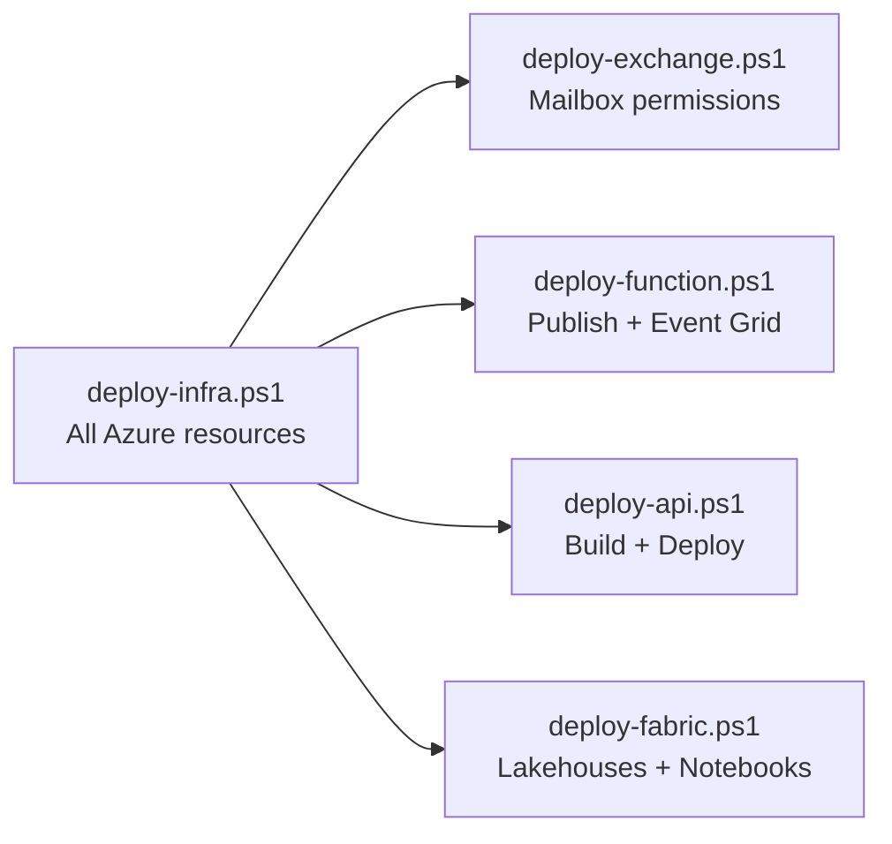

# Deployment Guide

All Azure infrastructure is provisioned via idempotent PowerShell scripts that use Azure CLI commands. Every resource is created only if it does not already exist. Names are derived from a configurable prefix in `deploy.config.toml`.

## Prerequisites

- Azure CLI (`az`) logged in with a subscription
- PowerShell 7+
- Python 3.11+ (for Azure Functions Core Tools)
- Node.js 18+ (for frontend build)
- Azure Functions Core Tools v4 (`func`)
- Exchange Online PowerShell module (for `deploy-exchange.ps1` only)

## Deployment Order

### 1. `deploy-infra.ps1` -- Provision Azure Resources

Creates (idempotently): Resource Group, Storage Account (containers: `uploads`, `prompts`, `function-definitions`, `schemas`), Service Bus namespace + queue (`q-invoice-process`), Cosmos DB (database: `spend`, containers: `invoices`, `user_sessions`), Azure OpenAI (chat + embedding deployments), Document Intelligence, AI Search, Function App (Flex Consumption, Python 3.11), App Service Plan + Web App (Python 3.11), RBAC assignments for both managed identities, and all app settings.

### 2. `deploy-exchange.ps1` -- Exchange Online Permissions

Grants `FullAccess` and `SendAs` on the shared mailbox to the Logic App connector identity. This is a one-time setup. After running, the Logic App's Office 365 connector must be authorized via a one-time OAuth sign-in in the Azure Portal.

### 3. `deploy-function.ps1` -- Deploy Azure Functions

Publishes the function app code, seeds processing prompts and function definitions to blob storage, syncs function triggers, and creates the Event Grid subscription (source: storage account `BlobCreated` on `uploads/` container, endpoint: `InvoiceIntake` function).

### 4. `deploy-api.ps1` -- Deploy API + Frontend

Builds the React frontend (`npm run build`), copies the dist output into `api/static/`, ZIP-deploys the API to App Service, and seeds the assistant system prompt to blob storage.

### 5. `deploy-fabric.ps1` -- Provision Fabric

Creates Fabric workspace folders, lakehouses (Landing, Bronze, Silver, Gold), and uploads all notebooks.

## Configuration Reference

See `deploy.config.toml` for all configurable values. Key sections are documented inline with comments.
