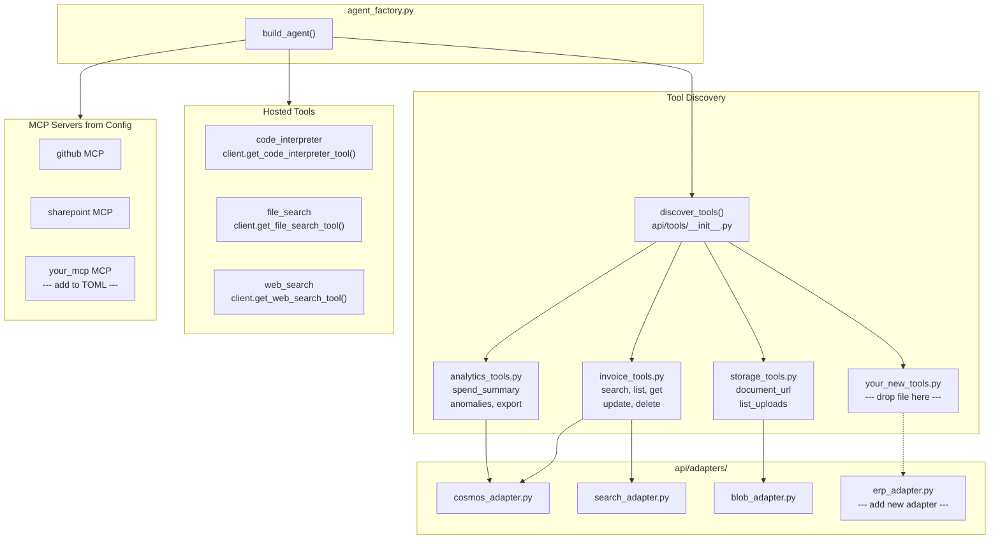

# Agent Extensibility

The Spend Analyzer agent is designed around three extension points. Each requires zero changes to the framework, routing, or factory code.

## Extension Architecture



## Extension Point 1: Add a New @tool Function

To give the agent a new capability backed by any Python code:

1. Create a new file in `api/tools/` (or add to an existing one)
2. Decorate functions with `@tool` from `agent_framework`
3. Use `Annotated[type, "description"]` for parameters
4. Return a JSON string

```python
# api/tools/budget_tools.py
from typing import Annotated
from agent_framework import tool
from api.adapters.cosmos_adapter import get_cosmos_client

@tool
def compare_to_budget(
    period: Annotated[str, "Time period, e.g. '2025-Q1' or '2025-01'"],
    department: Annotated[str, "Department to compare"] = "all",
) -> str:
    """Compare actual spend to budgeted amounts for a given period and department."""
    cosmos = get_cosmos_client()
    actuals = cosmos.query_spend(period=period, department=department)
    budgets = cosmos.query_budgets(period=period, department=department)
    variance = ((actuals - budgets) / budgets) * 100 if budgets else 0
    return json.dumps({"period": period, "actual": actuals, "budget": budgets, "variance_pct": variance})
```

The `discover_tools()` auto-discovery picks it up on next restart. No registration code, no config changes.

If your tool needs a new Azure service:
1. Add the adapter in `api/adapters/`
2. Add env vars to `api/common/config.py`
3. Add resource provisioning to `deploy-infra.ps1` (idempotent)
4. Add RBAC if needed

## Extension Point 2: Add a Hosted MCP Server

Add to `deploy.config.toml`:

```toml
[agent.mcp_servers.github]
url = "https://api.githubcopilot.com/mcp/"
approval_mode = "never_require"
```

The `agent_factory.py` iterates `[agent.mcp_servers]` and calls `client.get_mcp_tool()` for each entry. Hosted MCPs run on the model provider infrastructure and appear as native tools.

## Extension Point 3: Add an External API

1. Create adapter in `api/adapters/` (wraps HTTP client)
2. Create `@tool` function in `api/tools/` that uses the adapter
3. Add env vars and app settings

## Quick Reference

| What to add | Where | Config | Deploy |
|-------------|-------|--------|--------|
| Function tool | `api/tools/*.py` | None (auto-discovered) | None |
| Azure service | `api/adapters/` + `api/tools/` | env vars in `config.py` | resource + RBAC in `deploy-infra.ps1` |
| Hosted MCP | `[agent.mcp_servers]` in TOML | TOML only | URL in app settings |
| External API | `api/adapters/` + `api/tools/` | env vars | secrets in app settings |
| Hosted tool | `agent_factory.py` | TOML flag | None |
