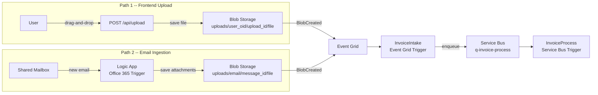
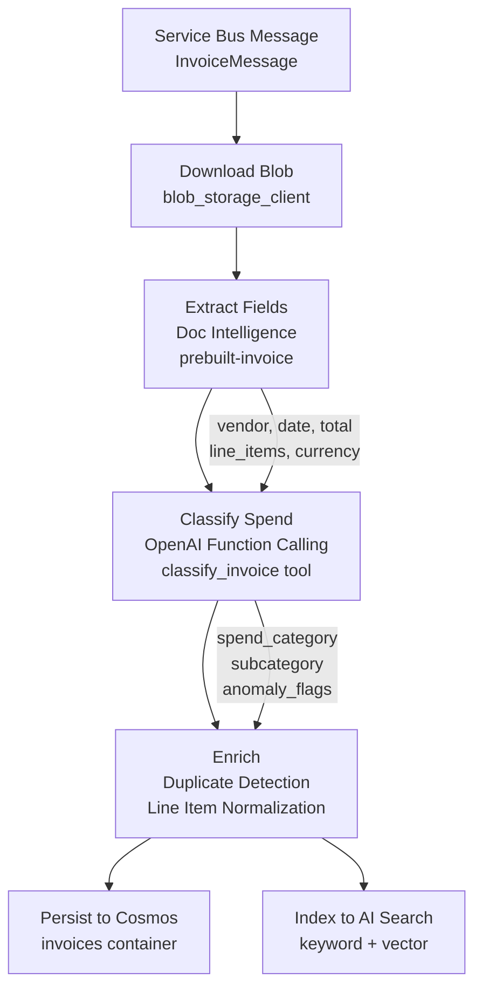
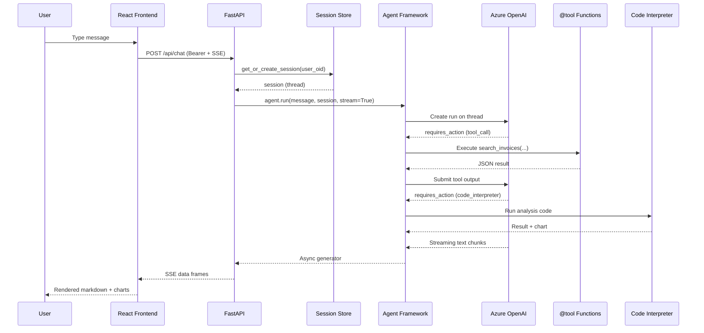
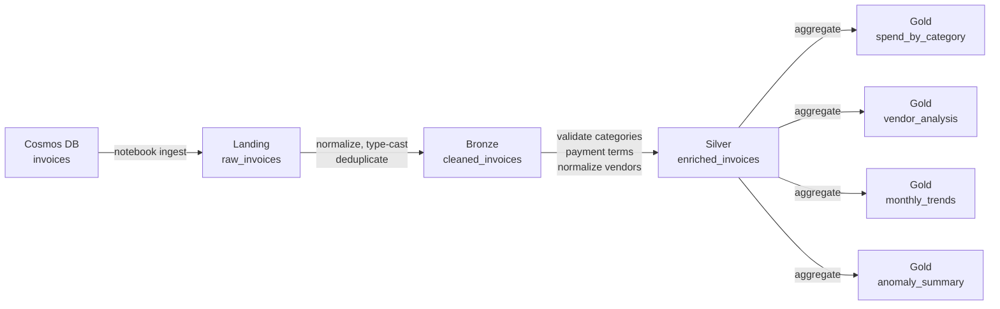

# Data Flow

## Ingestion Paths

```mermaid
flowchart LR
  subgraph path1 [Path 1 -- Frontend Upload]
    user["User"] -->|"drag-and-drop"| uploadUI["POST /api/upload"]
    uploadUI -->|"save file"| blobUp["Blob Storage\nuploads/user_oid/upload_id/file"]
  end

  subgraph path2 [Path 2 -- Email Ingestion]
    mailbox["Shared Mailbox"] -->|"new email"| logicApp["Logic App\nOffice 365 Trigger"]
    logicApp -->|"save attachments"| blobEmail["Blob Storage\nuploads/email/message_id/file"]
  end

  blobUp -->|"BlobCreated"| eventGrid["Event Grid"]
  blobEmail -->|"BlobCreated"| eventGrid

  eventGrid --> intake["InvoiceIntake\nEvent Grid Trigger"]
  intake -->|"enqueue"| serviceBus["Service Bus\nq-invoice-process"]
  serviceBus --> process["InvoiceProcess\nService Bus Trigger"]
```

## Processing Pipeline

```mermaid
flowchart TB
  trigger["Service Bus Message\nInvoiceMessage"] --> download["Download Blob\nblob_storage_client"]
  download --> extract["Extract Fields\nDoc Intelligence\nprebuilt-invoice"]
  extract --> classify["Classify Spend\nOpenAI Function Calling\nclassify_invoice tool"]
  classify --> enrich["Enrich\nDuplicate Detection\nLine Item Normalization"]
  enrich --> persistCosmos["Persist to Cosmos\ninvoices container"]
  enrich --> persistSearch["Index to AI Search\nkeyword + vector"]

  extract -->|"vendor, date, total\nline_items, currency"| classify
  classify -->|"spend_category\nsubcategory\nanomaly_flags"| enrich
```

## Agentic Chat Flow

```mermaid
sequenceDiagram
  participant U as User
  participant FE as React Frontend
  participant API as FastAPI
  participant SS as Session Store
  participant AF as Agent Framework
  participant OAI as Azure OpenAI
  participant T as @tool Functions
  participant CI as Code Interpreter

  U->>FE: Type message
  FE->>API: POST /api/chat (Bearer + SSE)
  API->>SS: get_or_create_session(user_oid)
  SS-->>API: session (thread)
  API->>AF: agent.run(message, session, stream=True)
  AF->>OAI: Create run on thread
  OAI-->>AF: requires_action (tool_call)
  AF->>T: Execute search_invoices(...)
  T-->>AF: JSON result
  AF->>OAI: Submit tool output
  OAI-->>AF: requires_action (code_interpreter)
  AF->>CI: Run analysis code
  CI-->>AF: Result + chart
  OAI-->>AF: Streaming text chunks
  AF-->>API: Async generator
  API-->>FE: SSE data frames
  FE-->>U: Rendered markdown + charts
```

## Fabric Medallion Pipeline

```mermaid
flowchart LR
  cosmos["Cosmos DB\ninvoices"] -->|"notebook ingest"| landing["Landing\nraw_invoices"]
  landing -->|"normalize, type-cast\ndeduplicate"| bronze["Bronze\ncleaned_invoices"]
  bronze -->|"validate categories\npayment terms\nnormalize vendors"| silver["Silver\nenriched_invoices"]
  silver -->|"aggregate"| gold1["Gold\nspend_by_category"]
  silver -->|"aggregate"| gold2["Gold\nvendor_analysis"]
  silver -->|"aggregate"| gold3["Gold\nmonthly_trends"]
  silver -->|"aggregate"| gold4["Gold\nanomaly_summary"]
```
