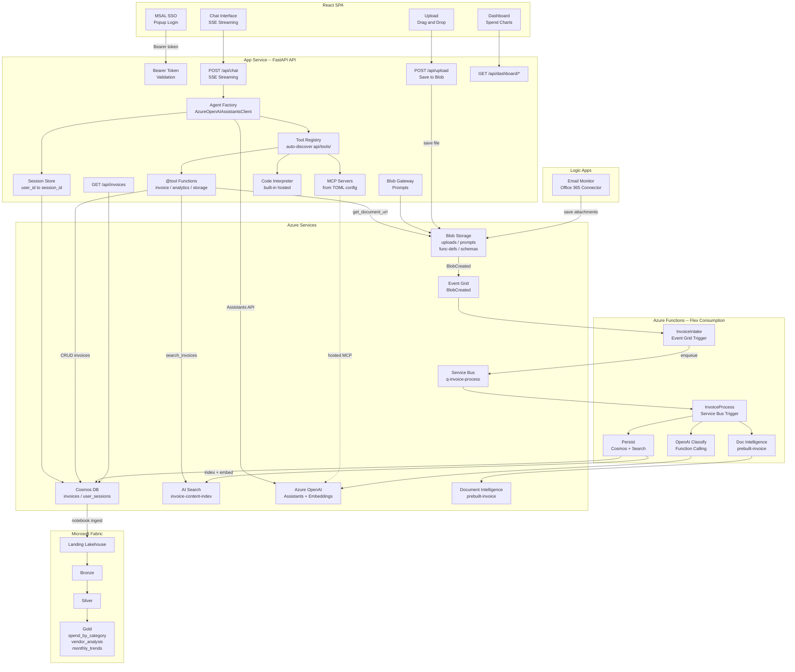

# System Overview

```mermaid
flowchart TB
  subgraph frontend [React SPA]
    msalAuth["MSAL SSO\nPopup Login"]
    chatUI["Chat Interface\nSSE Streaming"]
    dashboardUI["Dashboard\nSpend Charts"]
    uploadUI["Upload\nDrag and Drop"]
  end

  subgraph appService [App Service -- FastAPI API]
    authMiddleware["Bearer Token\nValidation"]
    chatRoute["POST /api/chat\nSSE Streaming"]
    uploadRoute["POST /api/upload\nSave to Blob"]
    dashRoute["GET /api/dashboard/*"]
    invoiceRoute["GET /api/invoices"]
    agentFactory["Agent Factory\nAzureOpenAIAssistantsClient"]
    sessionStore["Session Store\nuser_id to session_id"]
    toolRegistry["Tool Registry\nauto-discover api/tools/"]
    agentTools["@tool Functions\ninvoice / analytics / storage"]
    mcpServers["MCP Servers\nfrom TOML config"]
    codeInterp["Code Interpreter\nbuilt-in hosted"]
    blobGateway["Blob Gateway\nPrompts"]
  end

  subgraph functions [Azure Functions -- Flex Consumption]
    intakeFn["InvoiceIntake\nEvent Grid Trigger"]
    processFn["InvoiceProcess\nService Bus Trigger"]
    docIntelAdapter["Doc Intelligence\nprebuilt-invoice"]
    classifyAdapter["OpenAI Classify\nFunction Calling"]
    persistAdapter["Persist\nCosmos + Search"]
  end

  subgraph logicApps [Logic Apps]
    emailTrigger["Email Monitor\nOffice 365 Connector"]
  end

  subgraph azure [Azure Services]
    blob["Blob Storage\nuploads / prompts\nfunc-defs / schemas"]
    cosmos["Cosmos DB\ninvoices / user_sessions"]
    search["AI Search\ninvoice-content-index"]
    openai["Azure OpenAI\nAssistants + Embeddings"]
    docIntel["Document Intelligence\nprebuilt-invoice"]
    serviceBus["Service Bus\nq-invoice-process"]
    eventGrid["Event Grid\nBlobCreated"]
  end

  subgraph fabric [Microsoft Fabric]
    landing["Landing Lakehouse"]
    bronze["Bronze"]
    silver["Silver"]
    gold["Gold\nspend_by_category\nvendor_analysis\nmonthly_trends"]
  end

  msalAuth -->|"Bearer token"| authMiddleware
  chatUI --> chatRoute
  uploadUI --> uploadRoute
  dashboardUI --> dashRoute

  chatRoute --> agentFactory
  agentFactory -->|"Assistants API"| openai
  agentFactory --> sessionStore
  agentFactory --> toolRegistry
  toolRegistry --> agentTools
  toolRegistry --> mcpServers
  toolRegistry --> codeInterp
  sessionStore --> cosmos
  agentTools -->|"search_invoices"| search
  agentTools -->|"CRUD invoices"| cosmos
  agentTools -->|"get_document_url"| blob
  mcpServers -.->|"hosted MCP"| openai
  blobGateway --> blob

  uploadRoute -->|"save file"| blob
  blob -->|"BlobCreated"| eventGrid
  eventGrid --> intakeFn
  intakeFn -->|"enqueue"| serviceBus
  serviceBus --> processFn
  processFn --> docIntelAdapter
  docIntelAdapter --> docIntel
  processFn --> classifyAdapter
  classifyAdapter --> openai
  processFn --> persistAdapter
  persistAdapter --> cosmos
  persistAdapter -->|"index + embed"| search

  emailTrigger -->|"save attachments"| blob

  invoiceRoute --> cosmos

  cosmos -->|"notebook ingest"| landing
  landing --> bronze
  bronze --> silver
  silver --> gold
```
