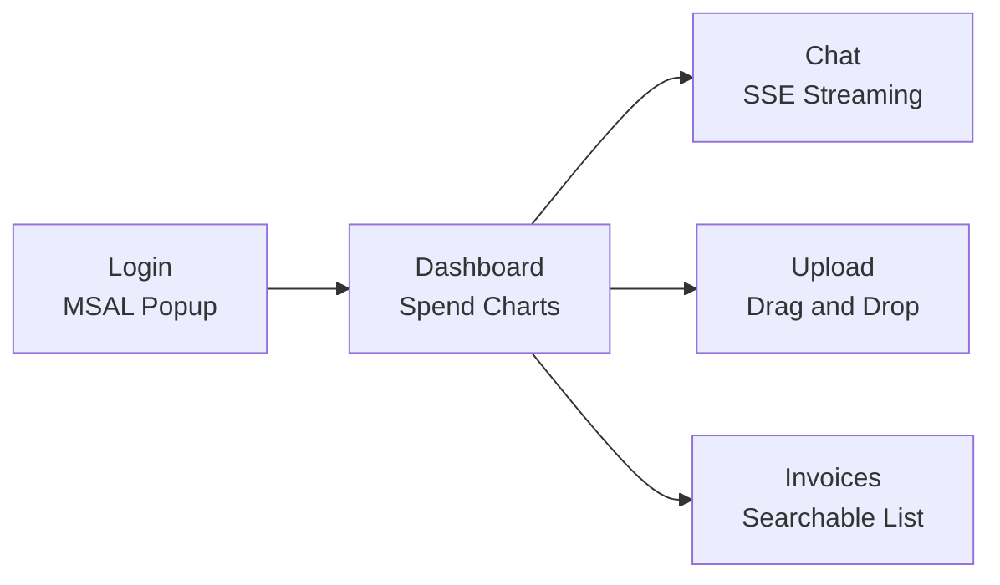

# Frontend -- React SPA

React 18 + Vite + Tailwind CSS single-page application with MSAL SSO authentication. Deployed as static files served by the FastAPI App Service.

## Pages



| Page | Route | Description |
|------|-------|-------------|
| Dashboard | `/` | Spend summary charts, recent activity, category breakdown |
| Chat | `/chat` | Streaming SSE chat with the agent (markdown rendering) |
| Upload | `/upload` | Drag-and-drop file upload with progress indicators |
| Invoices | `/invoices` | Searchable, filterable invoice list with detail view |

## Auth Flow

1. User clicks "Sign in" -- MSAL popup authenticates against Azure AD
2. `acquireTokenSilent` retrieves an access token (falls back to popup)
3. Every API call includes `Authorization: Bearer <token>`
4. `AuthGuard` component wraps the app -- unauthenticated users see only the login screen

## Tech Stack

- **React 18** with hooks
- **Vite** for fast dev/build
- **Tailwind CSS** for utility-first styling
- **@azure/msal-browser** + **@azure/msal-react** for SSO
- **react-router-dom** for client-side routing
- **react-markdown** + **remark-gfm** for chat message rendering
- **recharts** for dashboard charts

## Environment Variables

```
VITE_TENANT_ID=<azure-ad-tenant-id>
VITE_CLIENT_ID=<spa-client-id>
VITE_API_SCOPE=<api-scope>
VITE_API_BASE_URL=<app-service-url>
```
