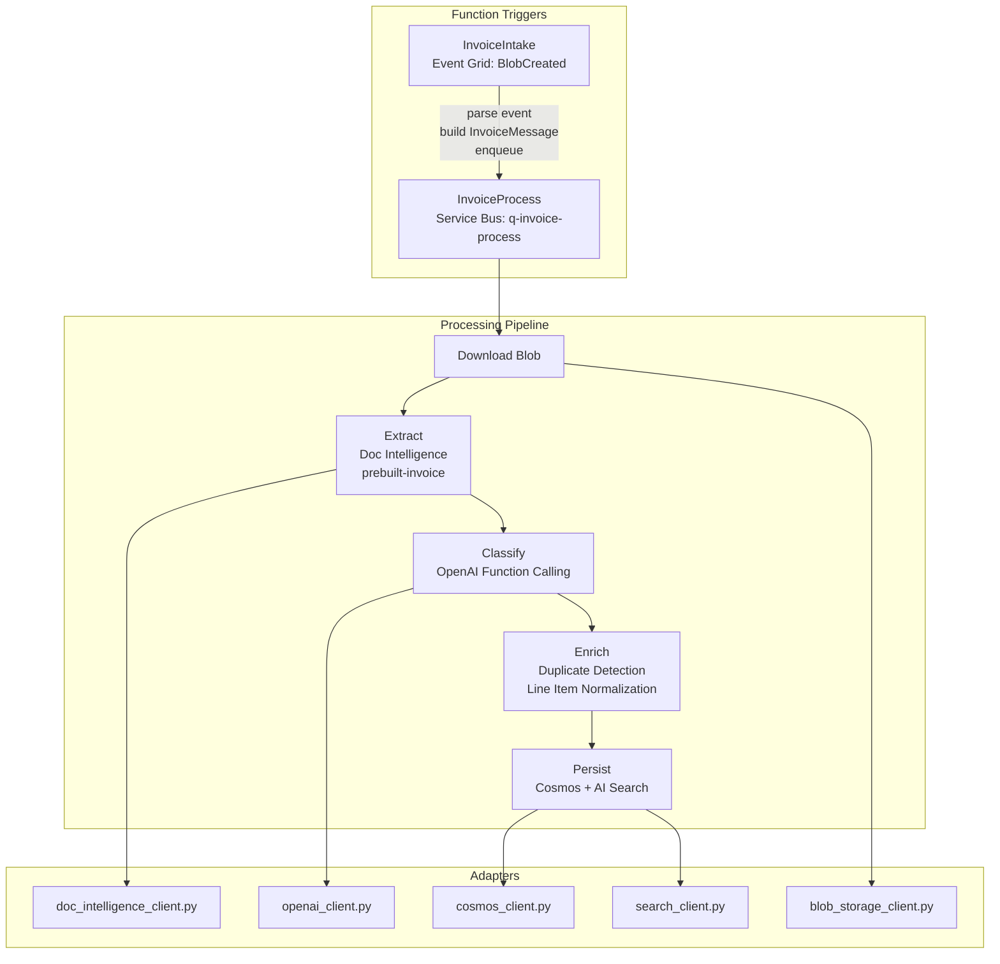

# Azure Functions -- Processing Pipeline

Python Azure Functions on Flex Consumption plan. Handles invoice ingestion and processing via Event Grid and Service Bus triggers.

## Architecture

## Functions

| Function | Trigger | Purpose |
|----------|---------|---------|
| `InvoiceIntake` | Event Grid (`BlobCreated`) | Parse blob event, build `InvoiceMessage`, enqueue to Service Bus |
| `InvoiceProcess` | Service Bus (`q-invoice-process`) | Full extraction, classification, enrichment, and persistence pipeline |

## Pipeline Steps

1. **Download**: Fetch the uploaded file from blob storage
2. **Extract**: Send to Document Intelligence `prebuilt-invoice` to get structured fields (vendor, date, total, line items, currency)
3. **Classify**: Send extracted text to Azure OpenAI with `classify_invoice` function calling tool to get spend category, subcategory, anomaly flags
4. **Enrich**: Detect potential duplicates (same vendor + amount + date), normalize line items
5. **Persist**: Upsert to Cosmos DB `invoices` container, index content + embeddings to AI Search

## Configuration

Settings are loaded from environment variables (set by `deploy-infra.ps1`). Prompts and function definitions use blob-first loading with local file fallback.
